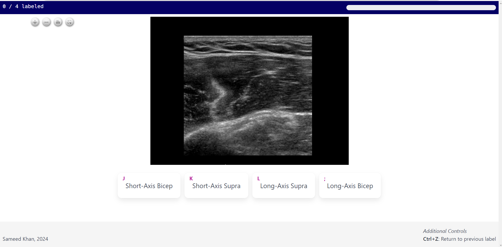

# Annotation Interface

A simple web application interface for annotating images of any kind.
Point the application to the folder where images are stored on your hard drive and enjoy a clean 
Anki-style labeling interface with labels bound to home-row keys.
This application does not require internet access and can be run entirely locally on your computer.
It is a "web" application only insofar that the interface was created for viewing inside of a 
browser, 
but it does not require online access and does not send your data 
or store it anywhere besides your hard drive.

## Features
- Fully on-device; no online storage of PHI
- Task-based interface: create your own tasks; have multiple collaborators labeling a task
- Anki-style keybinds to assign labels to images
- Export annotations as JSON for downstream analysis
- Works for images or any data type that can be rendered as an image (screenshots of sentences for 
sentence labeling, etc)
## To Use:
1. Clone this repository to disk
2. Install [`uv`](https://docs.astral.sh/uv/getting-started/installation/)
3. Open up the folder where you cloned the repo and un the following commands: 
    `> uv sync`  
    `> python -m src.app run`
4. Open up your browser and navigate to `http://localhost:8000`
5. Create a new user account, create a new task and point it toward a folder containing some images
to annotate on disk.
6. Happy annotating!